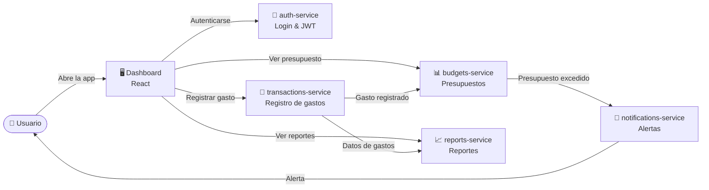

# 💰 Centavo — App de Finanzas Personales

Centavo es una aplicación de finanzas personales de uso individual que permite registrar gastos, definir presupuestos por categoría y recibir alertas automáticas cuando se acerca o supera un límite establecido.

---

## 🏗️ Arquitectura general



---

## 📁 Estructura del monorepo

```
centavo/
├── README.md                  ← Este archivo
├── docker-compose.yml         ← Orquestación local
├── .env.example               ← Variables de entorno de ejemplo
│
├── frontend/                  ← Dashboard web (React)
├── auth-service/              ← Autenticación y gestión de sesiones
├── transactions-service/      ← Registro y categorización de gastos
├── budgets-service/           ← Definición y seguimiento de presupuestos
├── notifications-service/     ← Motor de alertas y notificaciones
└── reports-service/           ← Generación de reportes automáticos
```

---

## 🧩 Descripción de cada pieza

### 🖥️ `frontend/`
Dashboard web construido con **React**. Permite al usuario:
- Iniciar sesión y gestionar su perfil.
- Registrar y visualizar gastos por categoría.
- Crear y monitorear presupuestos.
- Ver reportes de gasto mensuales e históricos.
- Recibir notificaciones de sobregasto en tiempo real.

Tecnologías sugeridas: React · Vite · TailwindCSS · React Query.

---

### 🔐 `auth-service/`
Microservicio responsable de la **autenticación y autorización** de usuarios.

Responsabilidades:
- Registro e inicio de sesión (email/contraseña).
- Generación y validación de **JWT** (access token + refresh token).
- Gestión de sesiones y cierre de sesión seguro.
- (Futuro) OAuth2 con Google/Apple.

Tecnologías sugeridas: Node.js · Express · bcrypt · jsonwebtoken · PostgreSQL.

---

### 💸 `transactions-service/`
Microservicio central para el **registro y categorización de gastos**.

Responsabilidades:
- CRUD de transacciones (monto, fecha, categoría, descripción).
- Categorización automática por palabras clave o reglas configurables.
- Consulta de historial de gastos con filtros (fecha, categoría, monto).
- Publicación de eventos al message broker cuando se registra un gasto.

Tecnologías sugeridas: Node.js · Express · PostgreSQL · Prisma ORM.

---

### 📊 `budgets-service/`
Microservicio para la **definición y seguimiento de presupuestos** por categoría.

Responsabilidades:
- CRUD de presupuestos (categoría, monto límite, período: semanal/mensual).
- Consulta del gasto actual vs. límite definido (integración con `transactions-service`).
- Publicación de eventos de alerta cuando un presupuesto alcanza el 80 % o el 100 %.

Tecnologías sugeridas: Node.js · Express · PostgreSQL · Prisma ORM.

---

### 🔔 `notifications-service/`
Microservicio responsable del **envío de alertas y notificaciones**.

Responsabilidades:
- Suscripción a eventos del message broker (`gasto_registrado`, `presupuesto_excedido`).
- Envío de notificaciones por **email**, push web o SMS según preferencias del usuario.
- Registro de historial de notificaciones enviadas.
- Gestión de preferencias de notificación por usuario.

Tecnologías sugeridas: Node.js · Nodemailer · Firebase Cloud Messaging · RabbitMQ / Redis.

---

### 📈 `reports-service/`
Microservicio para la **generación automática de reportes** de gasto.

Responsabilidades:
- Generación de reportes mensuales/semanales por categoría.
- Exportación en PDF o CSV bajo demanda.
- Análisis de tendencias de gasto (comparativa mes a mes).
- Suscripción a eventos para actualización incremental de reportes.

Tecnologías sugeridas: Node.js · pdfkit / exceljs · PostgreSQL · Cron jobs.

---

## 🚀 Inicio rápido (desarrollo local)

```bash
# 1. Clona el repositorio
git clone https://github.com/tu-usuario/centavo.git
cd centavo

# 2. Copia las variables de entorno
cp .env.example .env

# 3. Levanta todos los servicios con Docker Compose
docker compose up --build

# 4. Abre el dashboard
open http://localhost:3000
```

---

## 🛠️ Variables de entorno

Consulta [`.env.example`](.env.example) para la lista completa de variables requeridas por cada servicio.

---

## 🗺️ Roadmap

- [x] Definición de arquitectura y monorepo
- [ ] `auth-service` — registro e inicio de sesión
- [ ] `transactions-service` — CRUD de gastos
- [ ] `budgets-service` — CRUD de presupuestos
- [ ] `notifications-service` — alertas de sobregasto
- [ ] `reports-service` — reporte mensual en PDF
- [ ] `frontend` — dashboard completo
- [ ] CI/CD con GitHub Actions
- [ ] Despliegue en Railway / Render / AWS

---

## 📄 Licencia

MIT © 2026 — Proyecto de estudio Platzi · Antigravity
